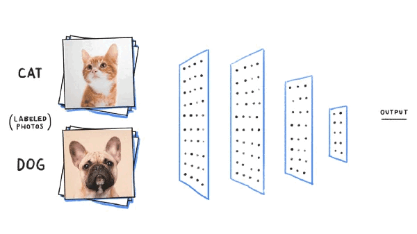
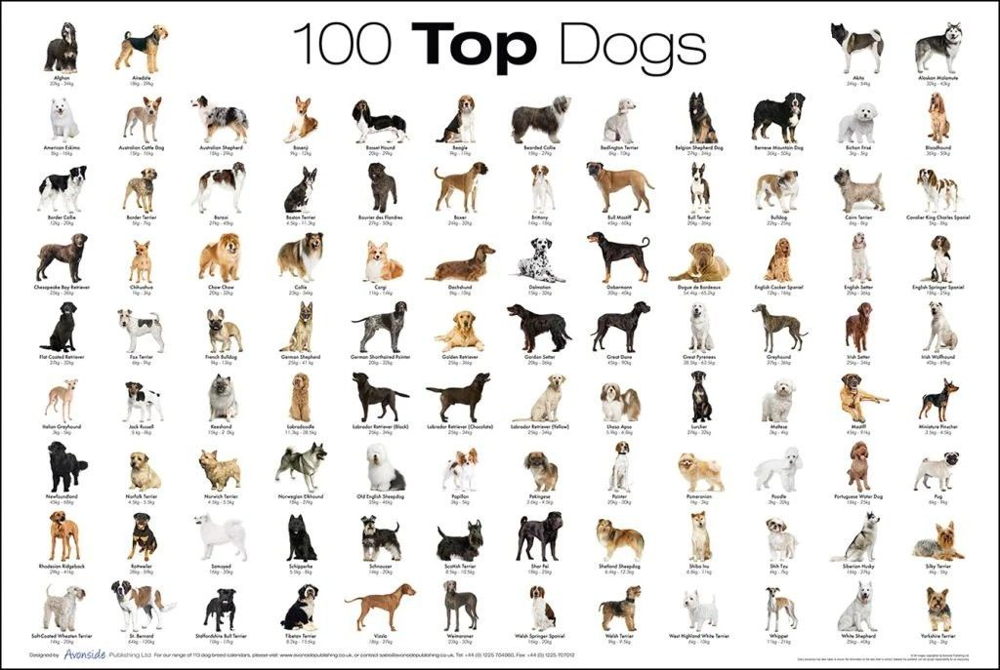
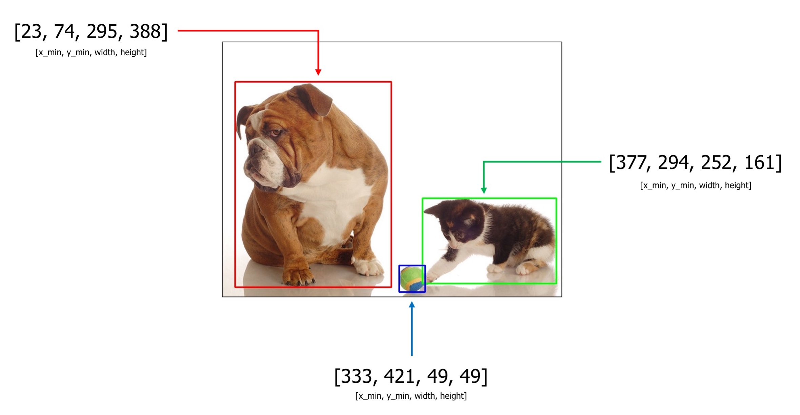
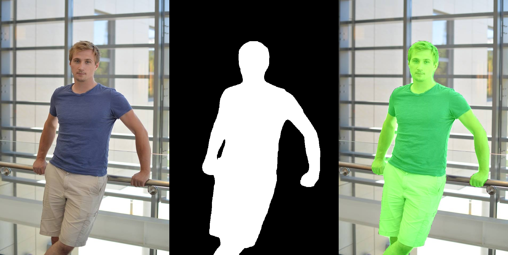
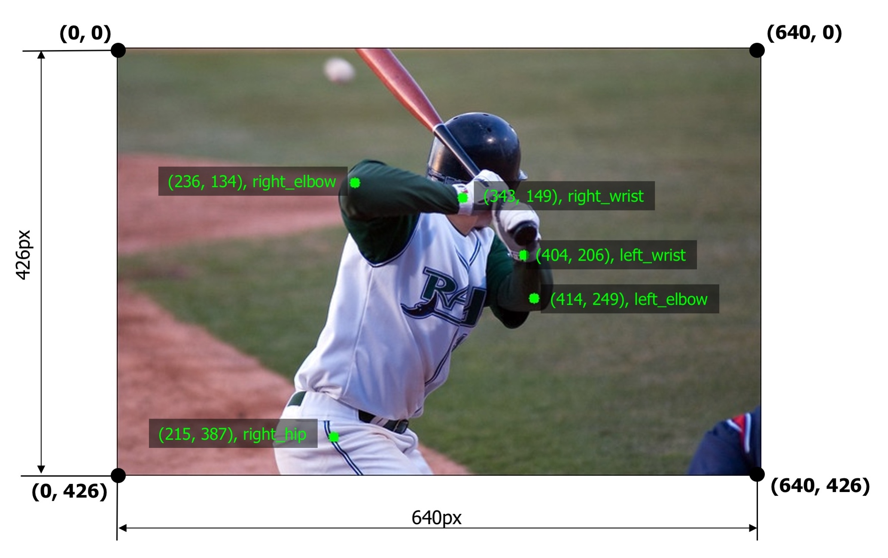
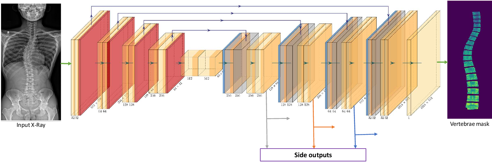
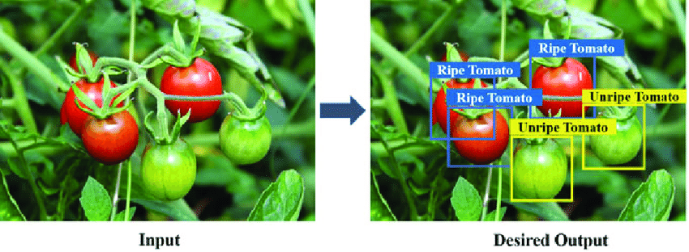
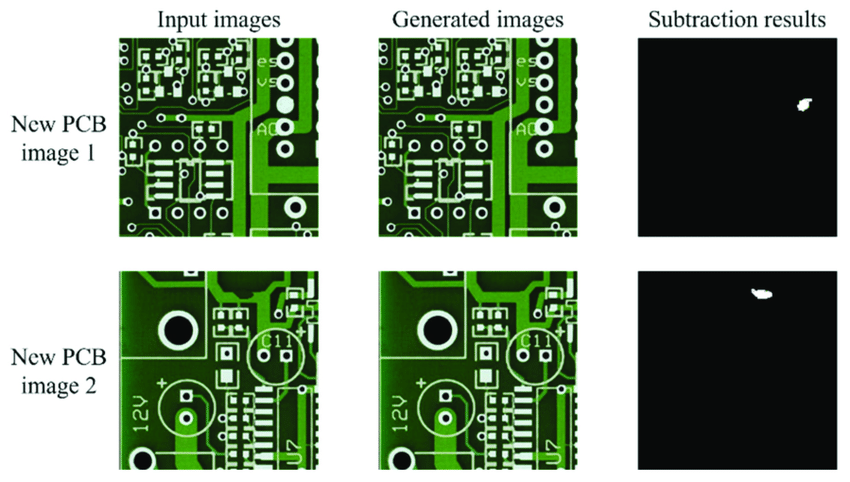
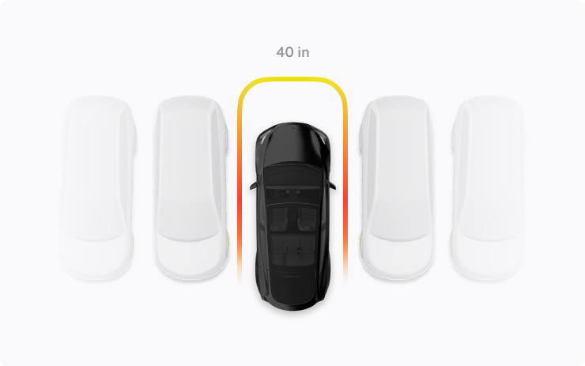
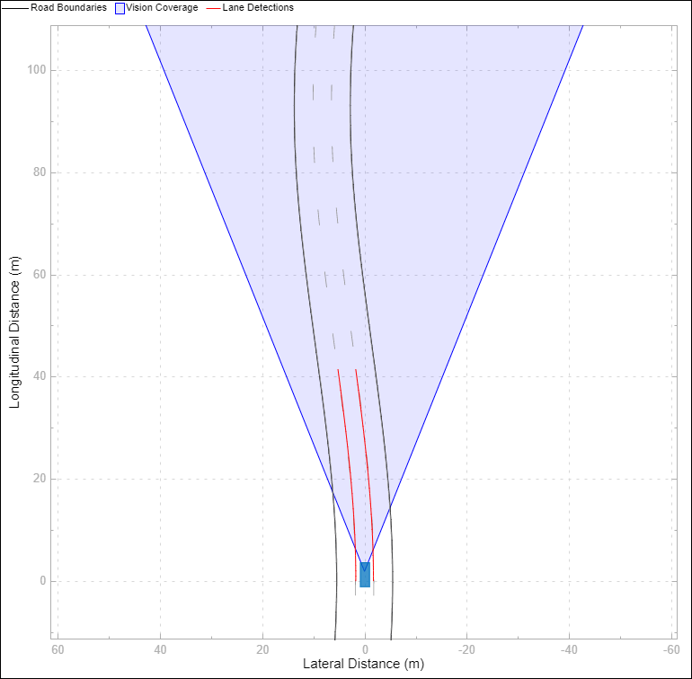

# OpenCV Nedir?
<b>OpenCV veya Open Source Computer Vision</b>, sahip olduğumuz resim ve videolarla çalışırken büyük katkıda destek sağlayacak bir kütüphanedir. Görüntü işleme, bilgisayar görüşü ve makine öğrenimi için geniş bir <b><i>işlevsellik yelpazesi sağlayan açık kaynaklı kodlardır</i></b>. OpenCV ilk olarak 1999 da <b>intel</b> tarafından kullanıma açıldı.

  
  

    Bilgisayarlı görünün amacı dışarıdaki nesneleri anlamaktır, <b><i>bilgisayar anlayabilmek için karmaşık algoritma ve kodları kullanır</i></b>.

Bilgisayarlı görünün artık hayatımızın her noktasına girmiş bulunmaktadır örnek olarak yüz algılama teknolojisi, kişinin yüzünü algılar ve bu yüzleri sınıflandırmaya çalışır.

Kullanılan diğer alanlardan biri de gözetim alanındadır, kullanılış amacı güvenlik kısmı için daha çok kullanılır kişinin hareketlerini incelenir ve olası tahminleri bilgisayar ortamında tahmin edilir.

OpenCV (Open Source Computer Vision) <b>açık kaynaklı bir kod kütüphanesidir</b> ve herkese açık olarak kullanılabilmektedir. Algılama ve tanıma olarak ikiye ayıralım bu ikisi birbirine karıştırılan terimler, algılama dışarıdan veya resimdeki kişinin ne olduğunu anlamaktır algılamak ise resimde gördüğü bu kişinin kim olduğunu anlama kısmıdır.

<b><i>C++ dili kullanılarak geliştirilmiş bir kütüphanedir</i></b> ama istenilen diller ile de kullanılabilir ama son yıllarda yoğun olarak kullanılmaya başlayan python ile devam ediyorum.
  

# Computer Vision Terms
Bilgisayarlı görüdeki temel olarak kullanılan kavramlar;
<ul>
    <li><h3><a href="https://klein.mathunion.org/matrices-and-digital-images/">Image Processing</a></h3></li>
        <ul> 
            <li>Cihazın dışarıda gördüğü şeylerin gördüğü nesnelerin ne olduğunu anlamaya çalışması yani aldığı görsel verileri işlemesidir.</li>
            <li>Görüntü işleme bir matematiksel işlemdir, bilgisayarda görüntüler bir matris olarak algılanır nxn boyutunda bir matris şeklinde algılanır. Resmin derinliği varsa daha da farklı matematiksel yöntemlere gidilir.</li>
             
             <figure>
              
              <figcaption>Figure 2: The matrix corresponding to Felix The Cat</figcaption>
              </figure>
              
            <figure>
              
              <figcaption>Figure 4: Matrix transformations</figcaption>
              </figure>
              
           <li>Yukarıda gördüğünüz resimdeki kedi felix 35x35 matris (pixel) kullanılarak ortaya çıkarılmıştır, ekrandaki siyah noktalar 1’i beyaz noktalar da 0’ı ifade ederler. </li>
           <li>Figure 4’te saat yönünde x derece döndürdüğümüzde bize basit bir eylem gibi gelsede bilgisayarda bir matrisi döndürmemiz gerekir, bu işlemi yapmak içinde matrisin transpozu alınır veya gerekli yöntemler ile istenilen şekle gelene kadar işlem devam eder.</li>
        </ul>       
</ul>

<ul>
    <li><h3><a href="https://medium.com/analytics-vidhya/image-classification-techniques-83fd87011cac">Image Classification</a></h3></li>
        <ul> 
            <li>Görüntüsünü aldığımız bir nesnenin ne olduğunu anlamaya veya sınıflandırmaya çalışılacak olan kısımdır.</li>
           
             <figure>
              
              <figcaption>Classification: Cat&Dog</figcaption>
              </figure>
              
            <li>Aldığımız görüntüler de Input ile Output kısımlarının arıasındaki işleme noktası ANN (Artificial Neurol Network) yapay sinir ağları kullanılarak işlem gerçekleştirilir. Arada kalan kısmın diğer adıda hidden layer olarakta adlandırabiliriz.</li>
            <li>Herşey den önce ANN kısmını eğitmemiz gerekmektedir ve bu eğitimi yaparken sınırları çizmeliyiz, yani verilen resimlerin önceden ne olduğunu öğretmeliyiz, bunun için bir veri kümesi oluşturuyoruz öğrenmseini istediğimiz veriler ile beraber.</li>
           
            <figure>
              
              <figcaption>Top 100 Dogs</figcaption>
              </figure>
              
           <li>Örnek olarak yukarıdaki gibi köpek türleri ve onlara air fotoğrafları ANN e vererek eğitmemiz gereklidir bunun içinde ciddi bir veri kümesine ihtiyaç duyarız.</li>
           
          <figure>
              
              <figcaption>image classification</figcaption>
              </figure>
              
           <li>Görüntü sınıflandırma çalışmalarında da görüntüyü tek bir sınıf olarak atamamız olmasıdır, modelimizi eğitme şeklimizde tek bir çıktı üzerine de eğitebiliriz veya modelin bilgisi olan veriler görselde varsa onlarında çıktılarını isteyebiliriz.</li>
            <li>Yukarıdaki görselde ki sayılar da modelin tahmin oranıdır 1’e ne kadar yakınsa o kadar güvenlirdir (confidence scor). </li>
        </ul>       
</ul>

<ul>
    <li><h3><a href="https://albumentations.ai/docs/getting_started/bounding_boxes_augmentation/">Object Detection</a></h3></li>
        <ul> 
            <li>Nesne tanıma ise görseldeki varlığın ne olduğunu algılar ve aynı zamanda o varlığın görselin ne tarafında olduğunu da algılamasıdır. Görüntünün içindeki nesnenin konumunu tahmin etme çalışması.</li>
             
             <figure>
              
              <figcaption>An example image with 3 bounding boxes from the COCO dataset</figcaption>
              </figure>
              
           <li>Yukarıda da gördüğünüz gibi görselin içinde 3 adet nesne tanınmış bunu yapabilmesi için önce bir ANN  geliştiriyoruz yani bir model bunun içinde bir veri seti oluşturmamız ve bu veiler ile de modelimizi istediğimiz görsel veya hedefe yönelik eğitmiş olammız gerekir. (yolo, rcnn, fasrtcnn)</li>
        </ul>       
</ul>

<ul>
    <li><h3><a href="https://medium.com/@sumit-kr-sharma/image-segmentation-in-computer-vision-438b54f3977e">Image Segmentation</a></h3></li>
        <ul> 
            <li>Verilmiş olan görüntünün içindedki pixellerde nesnenin ne kadar yer kapladığı alanı ölçer.</li>
             
              
              
           <li>Belirli derin öğrenme teknikleri ile yapılabilir, basit seviyede görüntü okuma ile yapılması zor olan bir işlemdir.(unet)</li>
        </ul>       
</ul>

<ul>
    <li><h3><a href="https://albumentations.ai/docs/getting_started/keypoints_augmentation/">Keypoint Detection</a></h3></li>
        <ul> 
            <li>Modelimiz ile eğitmeye çalıştığımız makineye belirli nesnelerin keypointlerini vererek daha sağlıklı bir veri sonucu elde edilir. Yüz, vücut hatları, kemik yapısı, hayvan türleri ve bir çok dahası gibi.</li>
             
          <figure>
              
              <figcaption>Keypoints annotations along with visualized edges between keypoints. Images are from the COCO dataset.</figcaption>
              </figure>
              
           <li>Key point kullanılmasının amaçları haraket takibi özellikle olsun daha çok o alanlarda kullanılır istenilen hareketin merkezi seçildikten sonra o alanın nasıkl bir şekilde haraket ettiğinin takip edilmsei gibi.</li>
           
          <figure>
              
              <figcaption>An example image with five keypoints from the COCO dataset</figcaption>
              </figure>
              
        </ul>       
</ul>

# Computer Vision Applications

<ul>
    <li><h3>Biomedical</h3></li>
        <ul> 
            <li>Hastalıkların eğitilmiş modellerce hızlı ve yüksek doğruluk oranı ile hesaplanması veya takip edilmesi olanağı sağlar.</li>
             
              
              
           <li><a href = "https://www.semanticscholar.org/paper/Analysis-of-Scoliosis-From-Spinal-X-Ray-Images-Imran-Huang/c72a7d1058eaa192098ffb5761d49d55f384f090/figure/1">Yukarıda</a> da görüdğünüz gibi bir röntgende ki kişinin omurgasının duruş bozukluğunu hesaplar ve hangi noktada nasıl bir sıkıntısı olduğunu analiz eder.</li>
           
              
              
        </ul>       
</ul>

<ul>
    <li><h3>Agriculture</h3></li>
        <ul> 
            <li>Meyvelerin takibi, oldunluk durumunu anlama ve sağlık durumunu takip için de kullanılabilir.</li>
             
              
              
        </ul>       
</ul>

<ul>
    <li><h3>Manufacturing</h3></li>
        <ul> 
            <li>Bir üretim hattında üretimi tamamlanmış ürünlerin kalite kontrol kısmında da yer alarak daha işlevsel ve hız bakımından da daha hızlı bir <a href="https://www.mdpi.com/journal/sensors/editors_choice?listby=type&page_no=2&page_count=50">sistem</a> kurulabilir.</li>
             
              
              
        </ul>       
</ul>

<ul>
    <li><h3>Automative</h3></li>
        <ul> 
            <li>Belli seviyelerde geliştirilmiş olan cihazların otomatikleştirilmesi ve bu sayede zaman, sağlık, maliyet ve bunun gibi bir çok alanda tasarruf sağlanmasını sağlamaktır.</li>
            <li>Örnek olarak arabalarda son yıllarda geliştirilmiş olan oto sürüş gibi ya da oto park sistemleridir.</li>
             
              
              
            <li>Şerit takip sistemleri bunun için arabanın hızını tekerleklerin dönüş yönünü ve bunun gibi bir çok dış etkenlerin hesaplamalarını öğretilmiş olan modeller ile otonom hale getirir.</li>
           
              
              
        </ul>       
</ul>

